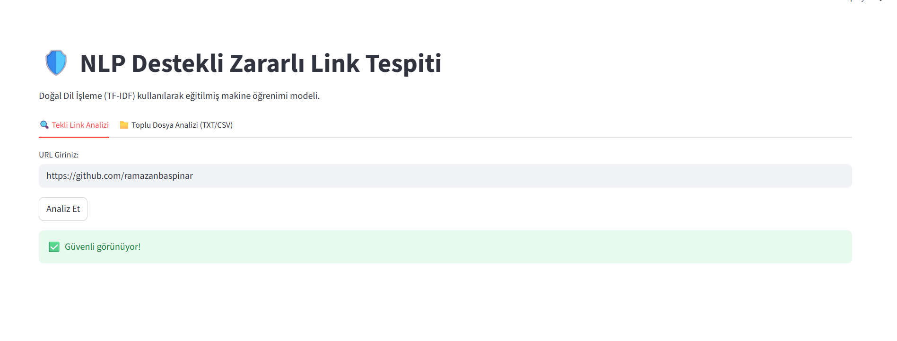
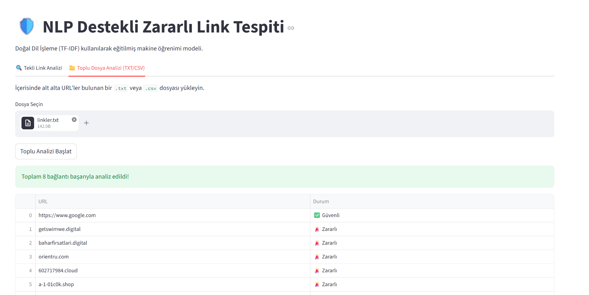
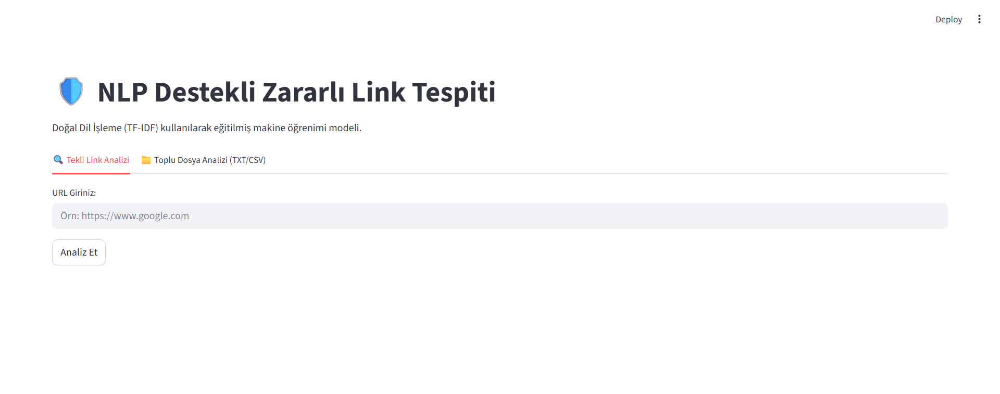

# Zararlı (Phishing) Bağlantı Tespit Sistemi

Bu proje, phishing (oltalama) bağlantılarını tespit etmek amacıyla geliştirilmiş makine öğrenimi tabanlı bir uygulamadır. Sistem, URL'lerin yapısal özelliklerini analiz ederek bağlantının zararlı olup olmadığını tahmin etmektedir.

Proje mimarisinde, URL metinlerini sayısallaştırmak için TF-IDF vektörizasyonu ve sınıflandırma işlemi için Logistic Regression modeli kullanılmıştır. Model, URL içerisindeki kalıpları öğrenerek gerçek zamanlı sınıflandırma işlemi gerçekleştirir.

---

## Kullanılan Teknolojiler

- **Python**
- **Pandas** — Veri işleme
- **Scikit-learn** — TF-IDF, Logistic Regression, model metrikleri
- **Streamlit** — Web arayüzü
- **Joblib** — Model kaydetme/yükleme

---

## Model Performansı

Model, Kaggle üzerinden alınan 100.000'den fazla URL barındıran veri seti üzerinde eğitilmiş ve test edilmiştir.

| Metrik    | Değer   |
|-----------|---------|
| Accuracy  | %95.04  |

---
## Kurulum

Sistemi yerel ortamınızda çalıştırmak için aşağıdaki adımlar izlenmelidir:

**1. Repoyu klonlayın:**
```bash
git clone https://github.com/ramazanbaspinar/zararli-link-tespiti.git
cd zararli-link-tespiti
```

**2. Gerekli kütüphaneleri yükleyin:**
```bash
pip install pandas scikit-learn streamlit joblib
```

**3. Modeli eğitin (Opsiyonel):**
```bash
python model.py
```
> **Not:** Eğitilmiş model dosyaları (`.pkl`) repoda hazır bulunduğu için bu adımı atlayıp doğrudan uygulamayı başlatabilirsiniz. Eğer modeli sıfırdan eğitmek isterseniz, veri setini [buradan](https://www.kaggle.com/datasets/taruntiwarihp/phishing-site-urls) indirip ana dizine koymalısınız. Bu adım `phishing_model_nlp.pkl` ve `tfidf_vectorizer.pkl` dosyalarını oluşturacaktır.

**4. Arayüzü başlatın:**
```bash
streamlit run app.py
```

---

## Özellikler

**Tekli Analiz**  
Kullanıcı tarafından girilen URL anlık olarak değerlendirilir. Sistem, bağlantıdaki `http`, `https` ve `www` gibi ön ekleri otomatik olarak temizleyerek modele yalnızca saf domain yapısını iletir.



**Toplu Analiz**  
Kullanıcılar `.txt` veya `.csv` formatında URL listeleri yükleyebilir. Sistem, listedeki tüm bağlantıları aynı anda analiz ederek sonuçları çıktı tablosu olarak sunar.



---

## Arayüz



Demo videosu: [assets/proje-demo.mp4](assets/proje-demo.mp4)

---

## Dosya Yapısı

```
zararli-link-tespiti/
│
├── app.py                    # Streamlit arayüzü
├── model.py                  # Model eğitim scripti
├── phishing_model_nlp.pkl    # Eğitilmiş model
├── tfidf_vectorizer.pkl      # NLP kelime dönüştürücü
│
├── assets/
│   ├── arayuz-genel.png
│   ├── tekli-analiz-guvenli.png
│   ├── toplu-analiz-tablosu.png
│   └── proje-demo.mp4
│
└── README.md
```

---

## Veri Seti

Modelin eğitiminde Kaggle üzerinde paylaşılan [Phishing Site URLs Dataset](https://www.kaggle.com/datasets/taruntiwarihp/phishing-site-urls) kullanıldı. Veri seti 100.000'den fazla URL içermekte olup, etiketler `good` (güvenli) ve `bad` (zararlı) olarak sınıflandırılmıştır.
